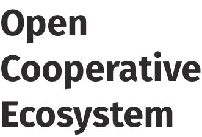
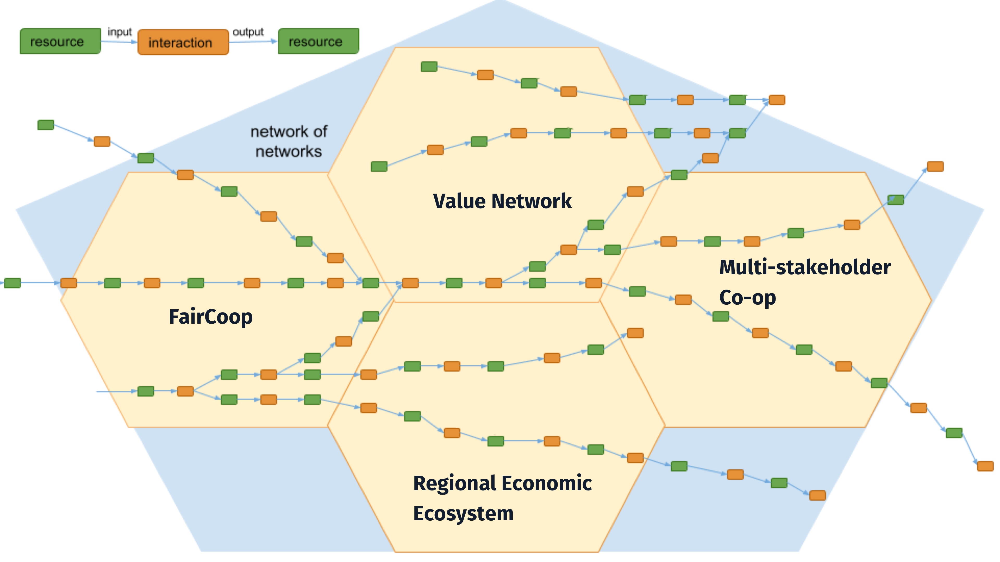

# Read me

The Open Apps Cooperative Ecosystem is an open networked organization that works toward creating and assembling economic and organizational software for use by groups working for systemic change on the ground. Our work is toward a collection of small open­source software applications that interoperate using standard vocabularies and protocols, to provide operational and analytical infrastructure, something similar to an operational system for a community.

Groups seeking change have many difficulties obtaining useful software. Our goal is to have freely­ available, modular, pluggable, and well ­documented applications, that can be assembled to meet a community's needs. This will allow future developers to create new open­ source applications for a group's specific needs or as technology advances, in their choice of languages, and plug them in relatively seamlessly. It will also allow existing software apps to create the linkage to be able to plug into the software ecosystem.

We are developers as well as facilitators, activists and users of our own applications. We have a committed core team with strong heterogeneous skill set and collectively many decades of experience. We also have looser circles of developers around the core that work on specific apps as needed. We always work in close collaboration with user groups actively working for change, so that all the work remains grounded in real needs, and immediately useful software is created.

In the past several years, we have worked with several food networks, and [sensorica](http://www.sensorica.co/), an open value network that designs open­source hardware. As of over a year ago, we are focusing primarily on the needs of FairCoop and Bank of the Commons, with secondary work with Mutual Aid Network.

We have taken an economic model that originated in academia called REA \(Resources-  Events - Agents\), and further developed it for the fair and sustainable economic networks of the future. This continues to inform all of our work.

Inside an Open Cooperative Ecosystem any kind of events can be represented:

* _flexible networks of networks relationships_
* _resource management and recipes_
* _planning and coordination for producing, using, exchanging and sharing value_
* _tracking events that produce, use, exchange and share value_
* _tracking contributions from individual network members of work and resources_
* _connecting value streams from idea to manufacture to end use and following them back_
* _distributing income according to contributions using "value equation" decided by contributors_
* _accounting views for a network, organization, project, individual_

The main point of an Open Cooperative Ecosystem is that _**everything is connected to everything else**_, thanks to its underlying syntax model: [**REA**](https://github.com/opencooperativeecosystem/website/tree/bd8b2402f315f37cd3fd434075da9ddd8d3f7190/Concepts/rea.md)

It can handle any economic relationships, value networks, distribution of value and ecological requirements.

We are developing software for transitioning to the next economy. Not this economy, the next economy.The next economy must be driven by human and ecological needs rather than profit. And it will be networked.  
The Open Apps Cooperative Ecosystem team is an open non­hierarchical group. Our governance is based on open assemblies and consensus decisions.  
Since our main focus is ecosystem interoperability and interconnections, we welcome any kind of diversity and experiments that can bring values to the ecosystem and can test the boundaries of our protocols and tools.

Our workflow so far includes weekly meetings ­ to update ourself about our on going work ­ and monthly meeting to shape together with the ecosystem our roadmap, plus daily chat to foster collaboration and development.  
All our work ­ code, documents, articles ­ are released open­source from the beginning.

We think that a digital cooperative ecosystem nowadays is critical to spread self­management activities and help the creation of alternative realities based on cooperation, decentralisation of power and mutualism. We try to embody these values in the way we craft our software and ensure that the protocols and tools we build allows these possibilities.

## Getting started

You can follow the [instruction](https://github.com/opencooperativeecosystem/website/tree/bd8b2402f315f37cd3fd434075da9ddd8d3f7190/introduction/get-started.md) to create your own instance of the Open cooperative ecosystem, or register to the faircoop one, and join the faircoop network.

## Documentation

* [Introduction](https://github.com/opencooperativeecosystem/website/tree/bd8b2402f315f37cd3fd434075da9ddd8d3f7190/history.md)
* [Apps Ecosystem](https://github.com/opencooperativeecosystem/website/tree/bd8b2402f315f37cd3fd434075da9ddd8d3f7190/apps-ecosystem.md)
* [Contribute](https://github.com/opencooperativeecosystem/website/tree/bd8b2402f315f37cd3fd434075da9ddd8d3f7190/contribute.md)
* [Concepts](https://github.com/opencooperativeecosystem/website/tree/bd8b2402f315f37cd3fd434075da9ddd8d3f7190/concepts.md)
* [Donations](https://github.com/opencooperativeecosystem/website/tree/bd8b2402f315f37cd3fd434075da9ddd8d3f7190/donations.md)

## Discussions

Join the [Welcome](https://t.me/ocewelcome) or the [Devs](https://t.me/joinchat/Bdq2d0yDFbjRbE2VPKqgrA) telegram group.

## Donation

We accept donation in faircoin: ** fNwjJzntaQ8P95mappWQkEiSVrtDqDzj4X**

## License

[AGPL 3.0](https://www.gnu.org/licenses/agpl-3.0.html)

